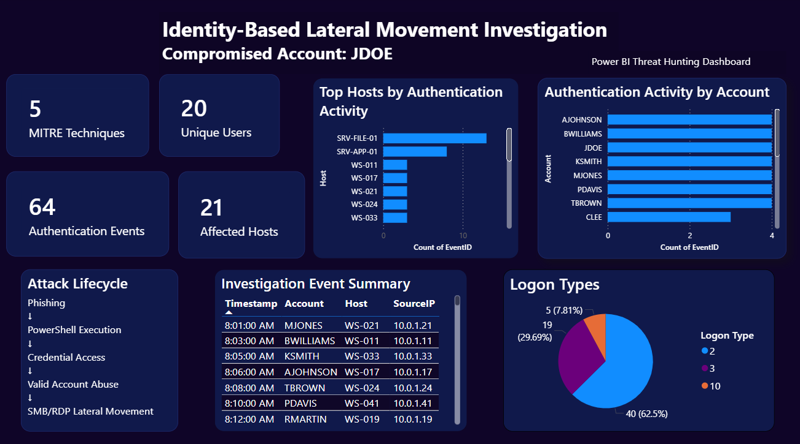
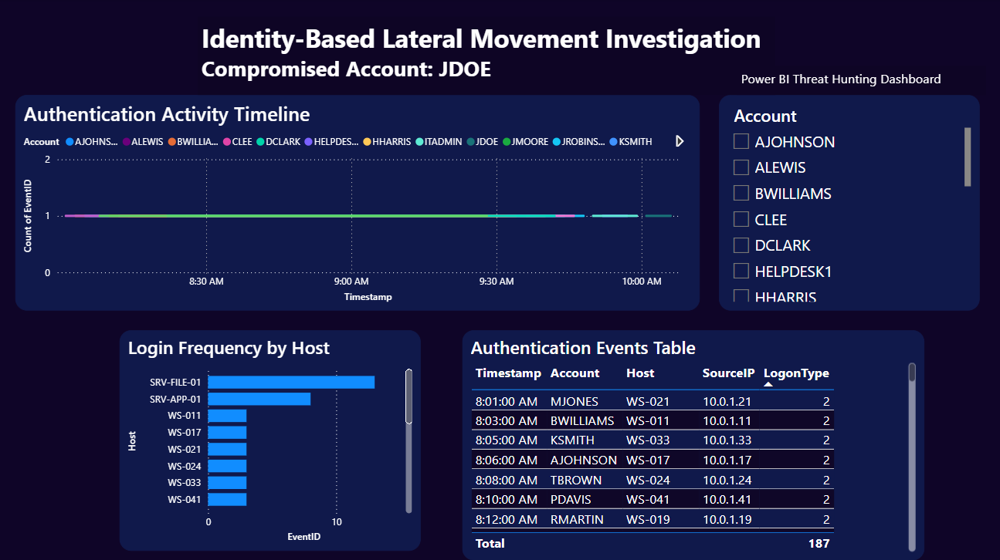
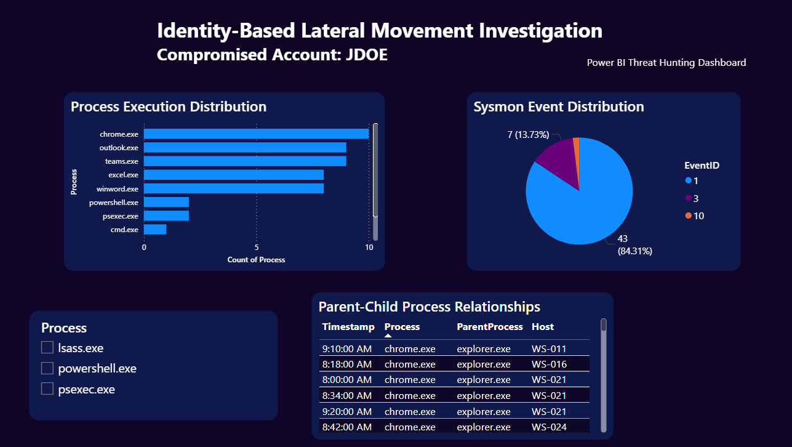
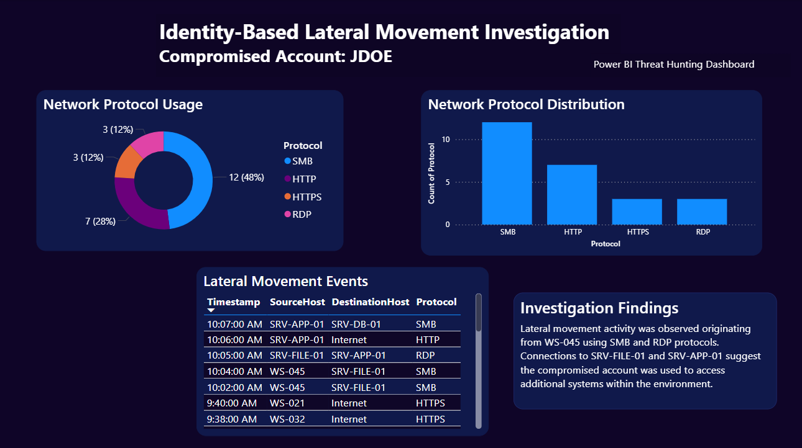
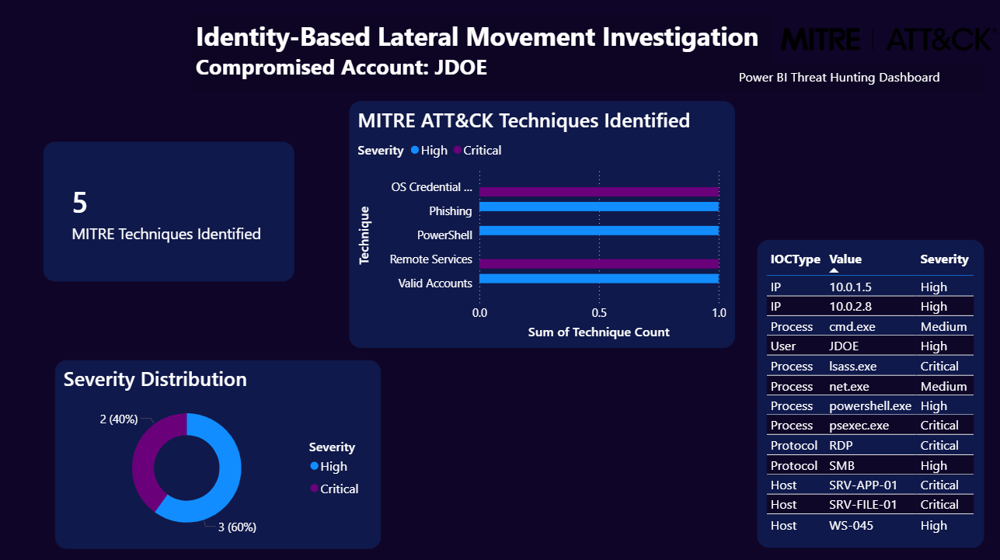
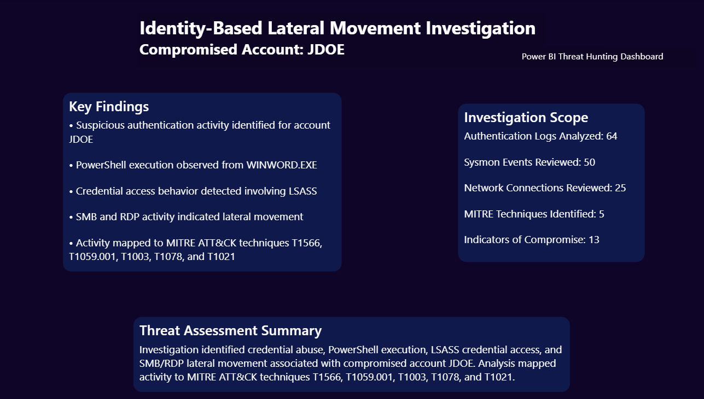

# Power BI Threat Hunting Dashboard


## Overview

This project showcases a cybersecurity threat hunting investigation conducted using Power BI.

Using simulated enterprise authentication, endpoint, network, and threat intelligence telemetry, the dashboard analyzes suspicious activity associated with a compromised account and visualizes the investigation process from initial access through lateral movement.

The project demonstrates practical skills in:

- Threat Hunting
- Security Analytics
- Incident Investigation
- Data Visualization
- Power BI Dashboard Development
- MITRE ATT&CK Mapping
- Threat Intelligence Analysis


## Investigation Scenario

A suspicious user account (**JDOE**) was identified during authentication monitoring.

Further investigation revealed:

- Suspicious PowerShell execution
- Credential access behavior involving LSASS
- Valid account abuse
- Lateral movement using SMB and RDP protocols

The investigation was conducted using simulated enterprise telemetry and mapped to relevant MITRE ATT&CK techniques.


## Technologies Used

- Power BI
- DAX
- Microsoft Excel
- Sysmon
- MITRE ATT&CK Framework
- Threat Intelligence Analysis
- Authentication Log Analysis
- Network Traffic Analysis
- Incident Response Methodology


## Data Sources

The dashboard was built using five simulated datasets:

| Dataset | Description |
|----------|-------------|
| AuthenticationLogs.csv | User authentication activity and logon events |
| SysmonLogs.csv | Endpoint process execution telemetry |
| NetworkLogs.csv | Network communication and lateral movement activity |
| MITRE.csv | ATT&CK technique mappings |
| IOC.csv | Indicators of Compromise identified during the investigation |


## Dashboard Pages

### Executive Overview

Provides a high-level overview of the investigation, including:

- Authentication Events
- Affected Hosts
- Unique Users
- MITRE Techniques Identified
- Logon Type Distribution
- Authentication Activity by Account
- Attack Lifecycle Overview


### Identity Analytics

Focuses on authentication activity and user behavior analysis.

Key Visualizations:

- Authentication Activity Timeline
- Login Frequency by Host
- Authentication Events Table
- Account-Based Investigation Filtering


### Endpoint Analysis

Analyzes endpoint activity collected through Sysmon.

Key Visualizations:

- Process Execution Distribution
- Sysmon Event Distribution
- Parent-Child Process Relationships
- Process-Based Investigation Filtering


### Lateral Movement

Investigates network activity associated with lateral movement.

Key Visualizations:

- Network Protocol Usage
- Network Protocol Distribution
- Lateral Movement Events
- Investigation Findings


### Threat Intelligence

Maps investigation findings to known adversary behaviors.

Key Visualizations:

- MITRE ATT&CK Techniques Identified
- Severity Distribution
- Indicators of Compromise (IOC) Table


### Threat Summary

Provides the final assessment and investigation conclusions.

Includes:

- Key Findings
- Investigation Scope
- Threat Assessment Summary


## Attack Lifecycle

The investigation followed the following attack sequence:

```text
Phishing
    ↓
PowerShell Execution
    ↓
Credential Access
    ↓
Valid Account Abuse
    ↓
SMB/RDP Lateral Movement
```


## Key Findings

- Suspicious authentication activity identified for account JDOE
- PowerShell execution observed through endpoint telemetry
- Credential access behavior detected involving LSASS
- SMB and RDP activity indicated lateral movement
- Activity mapped to MITRE ATT&CK techniques T1078, T1059.001, T1003, and T1021


## MITRE ATT&CK Techniques Identified

| Technique ID | Technique |
|-------------|-----------|
| T1078 | Valid Accounts |
| T1059.001 | PowerShell |
| T1003 | OS Credential Dumping |
| T1021 | Remote Services |
| T1566 | Phishing |


## Dashboard Screenshots

### Executive Overview




### Identity Analytics




### Endpoint Analysis




### Lateral Movement




### Threat Intelligence




### Threat Summary




## Skills Demonstrated

- Threat Hunting
- Security Operations (SOC) Analysis
- Incident Investigation
- Threat Intelligence
- MITRE ATT&CK Mapping
- Security Data Visualization
- Power BI Dashboard Development
- DAX Measures and KPIs
- Authentication Log Analysis
- Endpoint Detection and Analysis
- Network Traffic Analysis


## Repository Structure

```text
PowerBI-Threat-Hunting-Dashboard
│
├── data
│   ├── AuthenticationLogs.csv
│   ├── SysmonLogs.csv
│   ├── NetworkLogs.csv
│   ├── MITRE.csv
│   └── IOC.csv
│
├── screenshots
│   ├── ExecutiveOverview.png
│   ├── IdentityAnalytics.png
│   ├── EndpointAnalysis.png
│   ├── LateralMovement.png
│   ├── ThreatIntelligence.png
│   └── ThreatSummary.png
│
├── Identity-Based Lateral Movement Investigation Dashboard.pbix
│
└── README.md
```


## Author

**Roselyn Ojo**

Computer Information Systems Major | Cybersecurity Minor

Interests:
- Threat Hunting
- Threat Intelligence
- Security Operations (SOC)
- Incident Response
- Digital Forensics
- Cyber Defense

GitHub: https://github.com/R0sie-cyber
